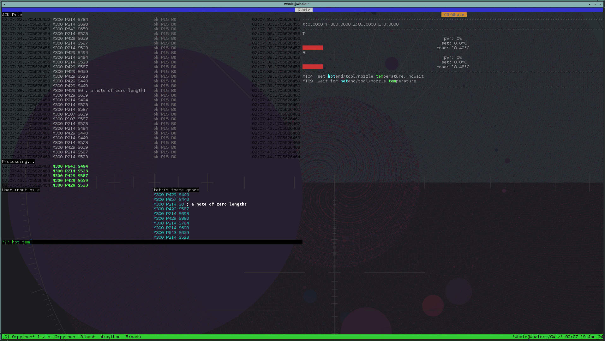

```
      ╻ ╻      ┏━╸   ┏━╸┏━┓╺┳┓┏━╸   ╻ ╻╻╺━┓┏━┓┏━┓╺┳┓      ╻ ╻
   ╺━╸╺╋╸╺━╸   ┃╺┓╺━╸┃  ┃ ┃ ┃┃┣╸    ┃╻┃┃┏━┛┣━┫┣┳┛ ┃┃   ╺━╸╺╋╸╺━╸
      ╹ ╹      ┗━┛   ┗━╸┗━┛╺┻┛┗━╸   ┗┻┛╹┗━╸╹ ╹╹┗╸╺┻┛      ╹ ╹
```
GWiz is an advanced gcode *"man-in-the-middleware"* that aims to make it comfortable to tune a machine (initial tuning and config) as well as tuning complicated prints[^print], including keeping track of all changes to a print in order to replay and gradually improve the prints. In the near future, it should enable synchronised collaborative work on an arbitrary number of machines.

## gp

This repository also include a command-line utility `gp` to pipe gcode from files or stdin to a machine ; unlike most similar utilities that can be found at the time of this writing, `gp` doesn't use the naive approach of *"I send a command and wait for an answer before sending the next command"* but instead uses threading for async read/writes. Unlike most similar utilies available, `gp` actually works.

### TODO

* when gcode files are provided as arguments, allow insertion of gcode commands with stdin, therefore combining the main features of `pronsole` and `printcore`.
* allow reading from an open file without closing it, like `tail` does

## GWiz

GWiz sort-of competes with [pronsole](https://github.com/kliment/Printrun) but it aims to be lighter, more flexible, more user-friendly. GWiz requires very few dependencies and uses [urwid](http://urwid.org/) as a toolkit, which allows a GUI-like feeling in a terminal or remote shell (ssh).

At the moment, resources used are still pretty high ; typically, a CB1 can be too slow to send instructions for production use (heavy stutter when there is a succession of short paths).

This program moves gcode instructions from the developper's mind (or G-Code file, pile 'zero') sequentially to a number of other piles:

- *WAIT* pile: instructions that are scheduled to be sent to the machine, but the machine's buffer is full (or we artificially throttle them[^throttle])
- *WIP* pile : instructions that have been sent to the machine's buffer, no ack or error message is available yet
- *ACK* pile : the last pile, instructions have been processed by the machine ; they have either an 'ok' message or an error message attached. This pile also contains most messages sent by the machine and user comments.


Other notable features include:
- searchable list of gcode commands by description (list set in machine config) ; in the future it will also display command usage (auto-fetched from firmware doc)
- a silly MIDI-to-M300 converted that is clueless about rythm so you can play your favorite tunes on your device's speaker

more info in the `proghelp.py` file (or when running the program itself).


# How to run GWiz

for example
```
./GWiz.py -c machine.conf -g part0.gcode -g part1.gcode 2>/tmp/gwiz.log
```

and simultaneously running
```
tail -f /tmp/gwiz.log
```
in another term for debug output should this be required.

# Note

G-Code Wizard is in early development stage.

# Screenshot



GWiz playing the Tetris theme while the user is searching for commands whose description contains the words terms `hot` and `tem`.


[^print]: prints or any other program sent to a machine
[^throttle]: reducing the number of commands in the machine buffer has a number of use cases, for example to allow insertion of other instructions or aborting/pausing prints faster: this is most useful during machine tuning. See `buffsize` command - or to be able to stop a print faster 
